# Windows Cybersecurity Home Lab

A hands-on Windows 11 cybersecurity home lab focused on user management, access control, security monitoring, and incident investigation.

## Lab Environment

- Oracle VirtualBox
- Windows 11 Pro
- Local administrator account: Labadmin
- Standard user account: Employee01

---

## Lab 1: User Accounts & Least Privilege

### Objective

The objective of this lab was to practice Windows user account management, privilege separation, and file access control using the principle of least privilege.

### Tasks Completed

- Created Employee01 as a standard Windows user.
- Verified the account's membership in the Users group.
- Tested User Account Control (UAC) and confirmed administrator credentials were required for privilege elevation.
- Created a simulated confidential company folder.
- Examined the folder's Access Control List (ACL).
- Disabled inherited permissions.
- Removed access for the Users and Authenticated Users groups.
- Verified that Employee01 could not access the confidential folder.

### UAC Privilege Elevation Test

Employee01 was unable to perform an administrative operation without providing administrator credentials.

### NTFS Permission Hardening

Permissions on the confidential folder were restricted to Administrators and SYSTEM.

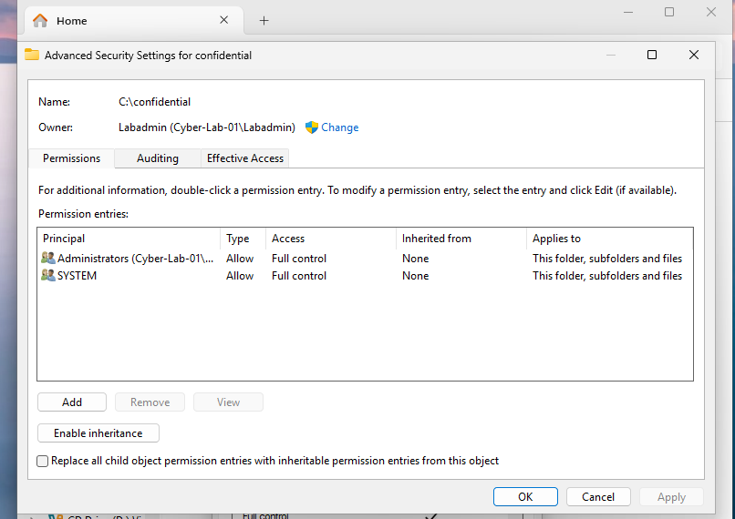

### Access Control Verification

After changing the NTFS permissions, I logged into Employee01 and attempted to access the confidential folder. Windows denied access, confirming that the permissions were working as intended.

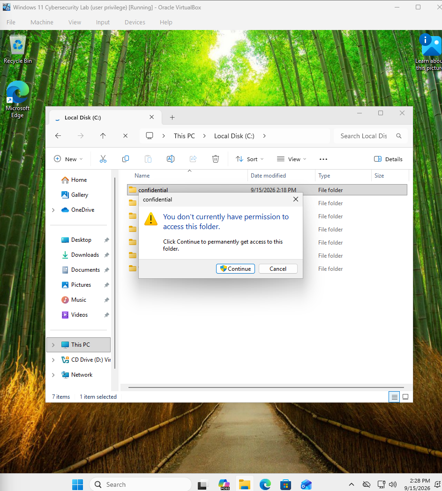

### Skills Practiced

- Windows user and group management
- User Account Control (UAC)
- Principle of least privilege
- NTFS file and folder permissions
- Access Control Lists (ACLs)
- Authentication and authorization
- Security control testing and verification

---

## Lab 2: Windows Event Viewer & Security Log Analysis

### Objective

The objective of this lab was to learn how to use Windows Event Viewer to identify, investigate, and document authentication activity. I simulated multiple failed login attempts and analyzed the resulting Windows Security events.

### Tasks Completed

- Navigated Windows Security logs using Event Viewer.
- Filtered security logs using Windows Event IDs.
- Identified Event ID 4624 for successful logons.
- Identified Event ID 4625 for failed logon attempts.
- Generated three controlled failed login attempts against Employee01.
- Investigated the account associated with the failed authentication attempts.
- Examined the failure reason and source information.
- Correlated multiple failed attempts with a subsequent successful login.
- Created a custom Event Viewer view for monitoring failed login attempts.

### Failed Login Investigation

Three incorrect passwords were intentionally entered for the Employee01 account to simulate repeated failed authentication attempts.

Event Viewer recorded these attempts as Event ID 4625.

#### Account and Failure Information

The event identified Employee01 as the account associated with the failed logon attempt. The failure reason reported an unknown user name or bad password.

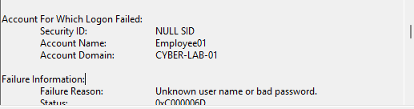

#### Source Information

The failed logon event showed the workstation as CYBER-LAB-01 and the source network address as 127.0.0.1, indicating that the recorded source was the local system.

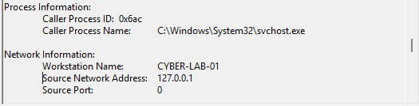

### Multiple Failed Login Attempts

Filtering the Security log for Event ID 4625 revealed three failed login attempts within several seconds.

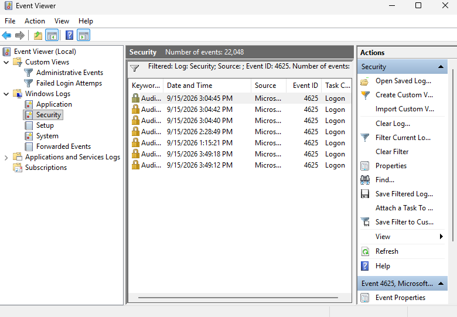

### Incident Timeline

| Time | Event ID | Result |
|------|----------|--------|
| 3:04:40 PM | 4625 | Failed logon |
| 3:04:42 PM | 4625 | Failed logon |
| 3:04:45 PM | 4625 | Failed logon |
| 3:04:50 PM | 4624 | Successful logon |

After three failed authentication attempts, Employee01 successfully logged into the system.

### Successful Logon Verification

Event ID 4624 confirmed that Employee01 successfully authenticated at 3:04:50 PM.

### Failed Login Monitoring

I created a custom Event Viewer view called **Failed Login Attempts** that displays Event ID 4625 from the Windows Security log. This provides a reusable method for reviewing failed authentication attempts without manually filtering the Security log each time.

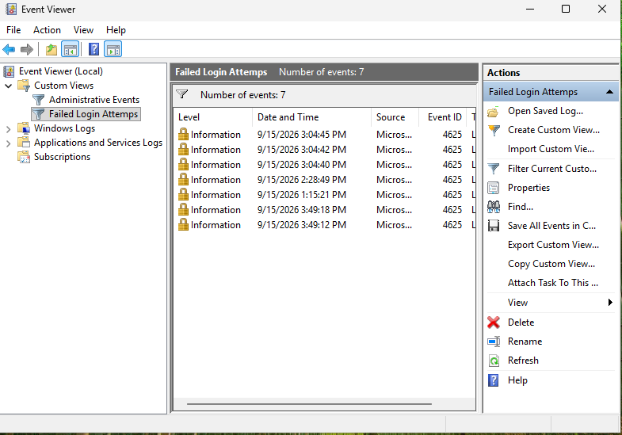

### Findings

The investigation identified three failed interactive authentication attempts against Employee01 followed by a successful authentication. Because these events were intentionally generated as part of the lab, they represented a controlled situation rather than an actual security incident.

This exercise showed how Windows Security logs can be used to identify authentication failures, correlate related events, and construct a basic incident timeline.

### Skills Practiced

- Windows Event Viewer
- Windows Security logs
- Security event filtering
- Event ID 4624 analysis
- Event ID 4625 analysis
- Failed login investigation
- Log correlation
- Incident timeline creation
- Basic security monitoring
- Authentication log analysis

---

## Lab 3: Microsoft Defender & Endpoint Security

### Objective

The objective of this lab was to explore Microsoft Defender, configure Windows endpoint security features, safely simulate a malware detection, investigate the alert, remediate the detected threat, and verify that the system was clean.

### Safe Malware Detection Test

I used the EICAR antivirus test file to safely test Microsoft Defender's detection capabilities. EICAR is a harmless test file designed to trigger antivirus software without using real malware.

Microsoft Defender successfully identified the file as **Virus:DOS/EICAR_Test_File** and classified the detection as Severe.

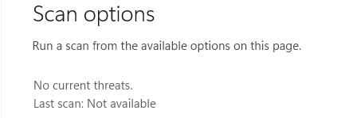

### Threat Investigation

I investigated the detection using Windows Security Protection History.

The investigation identified:

- **Threat:** Virus:DOS/EICAR_Test_File
- **Severity:** Severe
- **Initial status:** Active
- **Affected file:** `C:\Users\Labadmin\Documents\eicar.com`

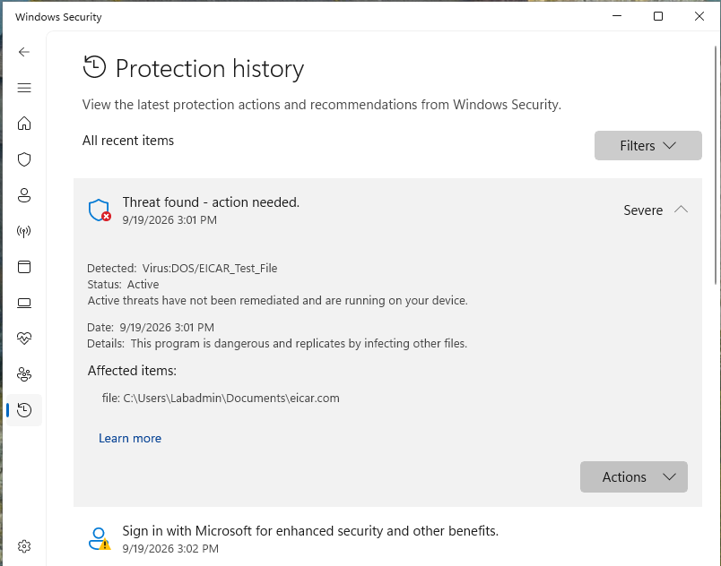

### Threat Remediation

I quarantined the detected EICAR test file using Microsoft Defender. Protection History confirmed that the threat status changed from Active to Quarantined.

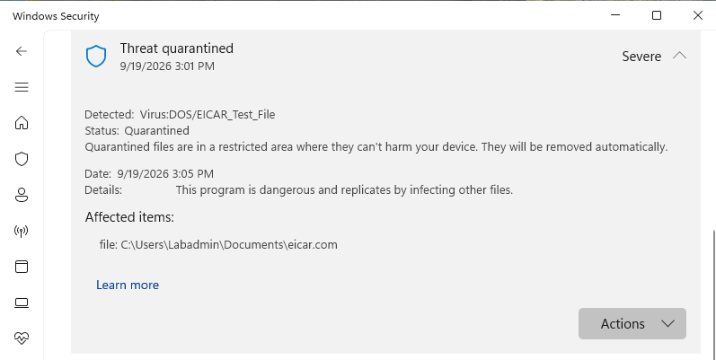

After quarantine, I verified that the EICAR test file was no longer available from its original location.

### Potentially Unwanted Application Protection

I reviewed Windows reputation-based protection settings and found that Potentially Unwanted Application (PUA) blocking was disabled.

I enabled:

- Potentially unwanted app blocking
- Block apps
- Block downloads

This provides additional protection against low-reputation or unwanted software that may not necessarily be classified as traditional malware.

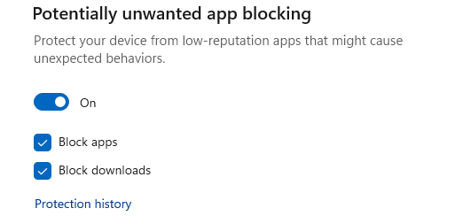

### Memory Integrity Troubleshooting

I attempted to enable Windows Memory Integrity as an additional system security control. Windows reported that an incompatible driver prevented the feature from being enabled.

I investigated the incompatible drivers and identified **E1G6032E.sys**, associated with the Intel(R) PRO/1000 MT Desktop Adapter used by the virtual machine.

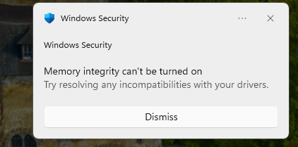

Further investigation in Device Manager showed:

- **Device:** Intel(R) PRO/1000 MT Desktop Adapter
- **Driver Provider:** Microsoft
- **Driver Version:** 8.4.13.0
- **Driver Date:** 3/23/2010

Because this network adapter provides network connectivity to the virtual machine, I did not remove the driver simply to enable Memory Integrity.

### Driver Update Investigation

I checked Windows for an updated driver for the Intel(R) PRO/1000 MT Desktop Adapter.

Windows reported that the best available driver was already installed. I documented the compatibility issue rather than removing a required network driver and potentially disrupting the VM's network connectivity.

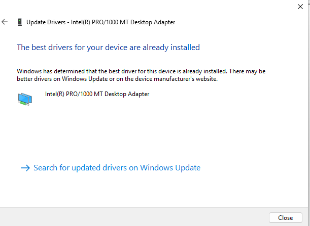

### Final Security Scan

After completing the EICAR test, threat remediation, security configuration, and driver investigation, I performed a Microsoft Defender Full Scan.

Results:

- **228,299 files scanned**
- **0 threats found**
- **No current threats**
- **Scan time:** 15 minutes 53 seconds

### Skills Practiced

- Microsoft Defender Antivirus
- Endpoint security
- Real-time malware protection
- Antivirus scanning
- Threat detection and investigation
- Protection History analysis
- Threat quarantine and remediation
- Potentially Unwanted Application (PUA) protection
- Windows reputation-based protection
- Core isolation and Memory Integrity
- Driver compatibility troubleshooting
- Windows Device Manager
- Endpoint security configuration
- Security verification
