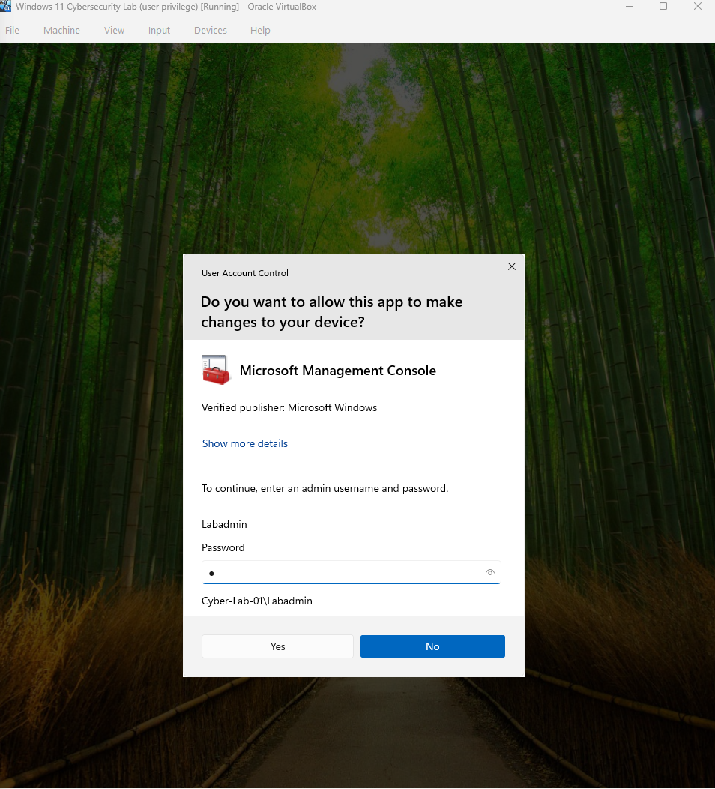

# windows-cybersecurity-home-lab
A hands-on Windows 11 cybersecurity home lab focused on user management, access control, security monitoring, and incident investigation.

## Lab Environment

- Oracle VirtualBox
- Windows 11 Pro
- Local administrator account: Labadmin
- Standard user account: Employee01

## Lab 1: User Accounts & Least Privilege

### Objective

The objective of this lab was to practice Windows user account management, privilege separation, and file access control using the principle of least privilege.

### Tasks Completed

- Created Employee01 as a standard Windows user.
- Verified the account's membership in the Users group.
- Tested User Account Control (UAC) and confirmed administrator credentials were required for privilege elevation.
- Created a simulated confidential company folder.
- Examined the folder's Access Control List (ACL).
- Disabled inherited permissions.
- Removed access for the Users and Authenticated Users groups.
- Verified that Employee01 could not access the confidential folder.

### UAC Privilege Elevation Test

Employee01 was unable to perform an administrative operation without providing administrator credentials.

### NTFS Permission Hardening

Permissions on the confidential folder were restricted to Administrators and SYSTEM.

### Access Control Verification

After changing the NTFS permissions, I logged into Employee01 and attempted to access the confidential folder. Windows denied access, confirming that the permissions were working as intended.

## Skills Practiced

- Windows user and group management
- User Account Control (UAC)
- Principle of least privilege
- NTFS file and folder permissions
- Access Control Lists (ACLs)
- Authentication and authorization
- Security control testing and verification

## Lab 2: Windows Event Viewer & Security Log Analysis

## Objective

The objective of this lab was to learn how to use Windows Event Viewer to identify, investigate, and document authentication activity. I simulated multiple failed login attempts and analyzed the resulting Windows Security events.

## Tasks Completed

- Navigated Windows Security logs using Event Viewer.
- Filtered security logs using Windows Event IDs.
- Identified Event ID 4624 for successful logons.
- Identified Event ID 4625 for failed logon attempts.
- Generated three controlled failed login attempts against Employee01.
- Investigated the account associated with the failed authentication attempts.
- Examined the failure reason and source information.
- Correlated multiple failed attempts with a subsequent successful login.
- Created a custom Event Viewer view for monitoring failed login attempts.

## Failed Login Investigation

Three incorrect passwords were intentionally entered for the Employee01 account to simulate repeated failed authentication attempts.

Event Viewer recorded these attempts as Event ID 4625.

### Account and Failure Information

The event identified Employee01 as the account associated with the failed logon attempt. The failure reason reported an unknown user name or bad password.

### Source Information

The failed logon event showed the workstation as CYBER-LAB-01 and the source network address as 127.0.0.1, indicating that the recorded source was the local system.

## Multiple Failed Login Attempts

Filtering the Security log for Event ID 4625 revealed three failed login attempts within several seconds.

## Incident Timeline

| Time | Event ID | Result |
|------|----------|--------|
| 3:04:40 PM | 4625 | Failed logon |
| 3:04:42 PM | 4625 | Failed logon |
| 3:04:45 PM | 4625 | Failed logon |
| 3:04:50 PM | 4624 | Successful logon |

After three failed authentication attempts, Employee01 successfully logged into the system.

## Successful Logon Verification

Event ID 4624 confirmed that Employee01 successfully authenticated at 3:04:50 PM.

## Failed Login Monitoring

I created a custom Event Viewer view called **Failed Login Attempts** that displays Event ID 4625 from the Windows Security log. This provides a reusable method for reviewing failed authentication attempts without manually filtering the Security log each time.

## Findings

The investigation identified three failed interactive authentication attempts against Employee01 followed by a successful authentication. Because these events were intentionally generated as part of the lab, they represented a controlled situation rather than an actual security incident.

This exercise showed how Windows Security logs can be used to identify authentication failures, correlate related events, and construct a basic incident timeline.

## Skills Practiced

- Windows Event Viewer
- Windows Security logs
- Security event filtering
- Event ID 4624 analysis
- Event ID 4625 analysis
- Failed login investigation
- Log correlation
- Incident timeline creation
- Basic security monitoring
- Authentication log analysis
